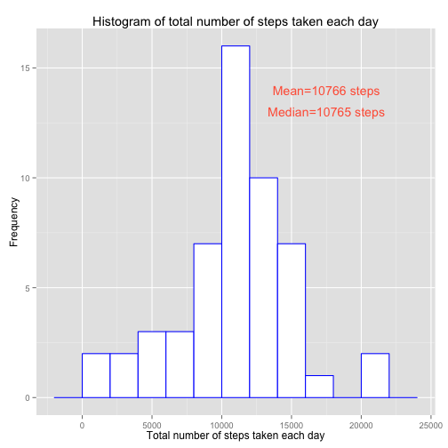
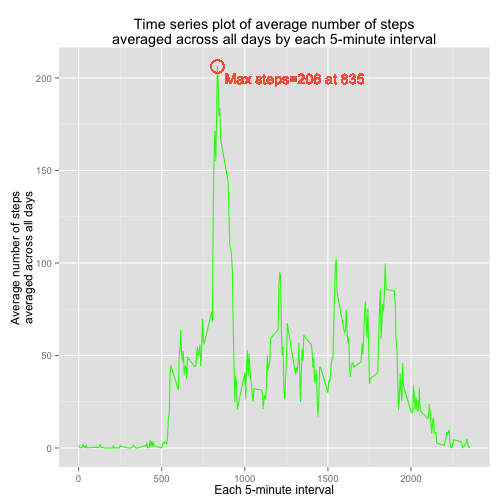
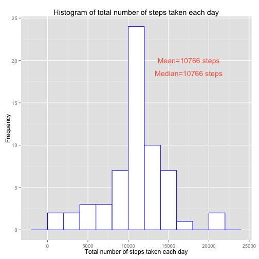
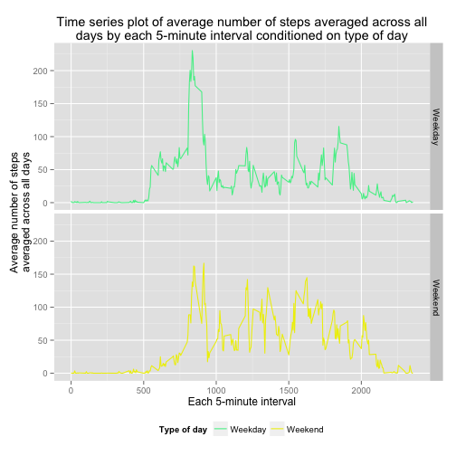

####Reading in the data set and examining the variables.


```r
act = read.csv("/Users/themrjw/Desktop/Reproducible Research Course/Peer Assessment 1/activity.csv")
str(act)
```

```
## 'data.frame':	17568 obs. of  3 variables:
##  $ steps   : int  NA NA NA NA NA NA NA NA NA NA ...
##  $ date    : Factor w/ 61 levels "2012-10-01","2012-10-02",..: 1 1 1 1 1 1 1 1 1 1 ...
##  $ interval: int  0 5 10 15 20 25 30 35 40 45 ...
```

####Investigating the mean total number of steps taken per day
Steps:  
1. First create a new data frame where the variable steps is not missing  
2. Change the date variable from factor format to character format  
3. Take the sum of all number of steps corresponding to each unique date  
4. Create the histogram


```r
act1 = subset(act, !is.na(steps))
act1$date = as.character(act1$date)
steps.day1 = tapply(act1$steps, act1$date, sum)

library(ggplot2)

ggplot() + geom_histogram(aes(x=steps.day1), fill="white", color="blue", binwidth=2000) + 
  ggtitle("Histogram of total number of steps taken each day") + 
  ylab("Frequency") + xlab("Total number of steps taken each day") + 
  geom_text(aes(x=17500,y=14,label=paste("Mean=",round(mean(steps.day1))," steps",sep="")), color="tomato") + 
  geom_text(aes(x=17500,y=13,label=paste("Median=",round(median(steps.day1))," steps",sep="")), color="tomato")
```

 

```r
round(mean(steps.day1))
```

```
## [1] 10766
```

```r
round(median(steps.day1))
```

```
## [1] 10765
```

The mean number of steps each day is 1.0766 &times; 10<sup>4</sup> and the median number of steps each day is 1.0765 &times; 10<sup>4</sup>.

####Investigating the average daily activity pattern  
Steps:  
1. Calculate the mean number of steps per 5-minute interval across all days  
2. Create the time series plot


```r
avg.steps1 = aggregate(act1$steps, by=list(act1$interval), mean)

ggplot(avg.steps1) + geom_line(aes(x=Group.1, y=x), color="green") + 
  ggtitle("Time series plot of average number of steps\naveraged across all days by each 5-minute interval") +
  ylab("Average number of steps\naveraged across all days") + xlab("Each 5-minute interval") + 
  geom_point(aes(x=avg.steps1$Group.1[which.max(avg.steps1$x)], y=max(avg.steps1$x)), shape=1, color="tomato", size=6) + 
  geom_text(color="tomato",aes(x=1300, y=200, label=paste("Max steps=",round(max(avg.steps1$x)),
                                                          " at ",avg.steps1$Group.1[which.max(avg.steps1$x)],sep="")))
```

 

```r
avg.steps1$Group.1[which.max(avg.steps1$x)]
```

```
## [1] 835
```

The 5-minute interval that contains the maximum number of steps, on average across all days, is 835.

####Imputing missing values of steps


```r
table(is.na(act$steps))
```

```
## 
## FALSE  TRUE 
## 15264  2304
```

There are 2304 rows with missing values of steps.

Strategy to impute missing values of steps:  
1. Find the indices where the 5-minute interval is equal to the current 5-minute interval and steps is missing  
2. With those indices, replace the missing values of steps with the mean number of steps for that 5-minute interval  
3. Repeat for all unique 5-minute intervals  


```r
act2 = act

i=0
while(i<=length(unique(act2$interval)))
{
  i=i+1
  ind = which(act2$interval==unique(act2$interval)[i] & is.na(act2$steps))
  act2$steps[ind] = mean(act2$steps[act$interval==unique(act2$interval)[i]], na.rm=TRUE)
}
```

Histogram with missing data filled in:


```r
act2$date = as.character(act2$date)
steps.day2 = tapply(act2$steps, act2$date, sum)

ggplot() + geom_histogram(aes(x=steps.day2), fill="white", color="blue", binwidth=2000) + 
  ggtitle("Histogram of total number of steps taken each day") + 
  ylab("Frequency") + xlab("Total number of steps taken each day") + 
  geom_text(aes(x=17500,y=20,label=paste("Mean=",round(mean(steps.day2))," steps",sep="")), color="tomato") + 
  geom_text(aes(x=17500,y=18.5,label=paste("Median=",round(median(steps.day2))," steps",sep="")), color="tomato")
```

 

```r
round(mean(steps.day2))
```

```
## [1] 10766
```

```r
round(median(steps.day2))
```

```
## [1] 10766
```

The mean number of steps each day is 1.0766 &times; 10<sup>4</sup> and the median number of steps each day is 1.0766 &times; 10<sup>4</sup>.  These current values are similar to the estimates before.  However, there is an increase in the number of days where the total number of steps is at the mean number of steps each day.

####Investigating activity patterns between weekdays and weekends

Steps:  
1. Change the date variable to date format  
2. Create a new variable called days where it takes the value of "Weekend" for Sunday and Saturday and "Weekday" otherwise  
3. Calculate the mean number of steps per time interval, on average across all days, for weekdays and weekends  
4. Create the time series plot conditioning on type of day  


```r
act2$date = as.Date(act2$date)
act2$days = "Weekday"
act2$days[which(weekdays(act2$date)=="Sunday" | weekdays(act2$date)=="Saturday")] = "Weekend"

avg.steps2 = aggregate(act2$steps, by=list(act2$interval, act2$days), mean)

ggplot(avg.steps2) + geom_line(aes(x=Group.1, y=x, color=Group.2)) + 
  ggtitle("Time series plot of average number of steps averaged across all
          days by each 5-minute interval conditioned on type of day") +
  ylab("Average number of steps\naveraged across all days") + xlab("Each 5-minute interval") + facet_grid(Group.2~.) +
  scale_color_manual(name="Type of day", values=c("seagreen2","yellow2")) +
  theme(legend.position="bottom") 
```

 


```r
mean(avg.steps2$x[which(avg.steps2$Group.2=="Weekday")])
```

```
## [1] 35.61
```

```r
mean(avg.steps2$x[which(avg.steps2$Group.2=="Weekend")])
```

```
## [1] 42.37
```

The average number of steps for each 5-minute interval on average across all weekdays is 36 and on average across all weekends is 42.  
